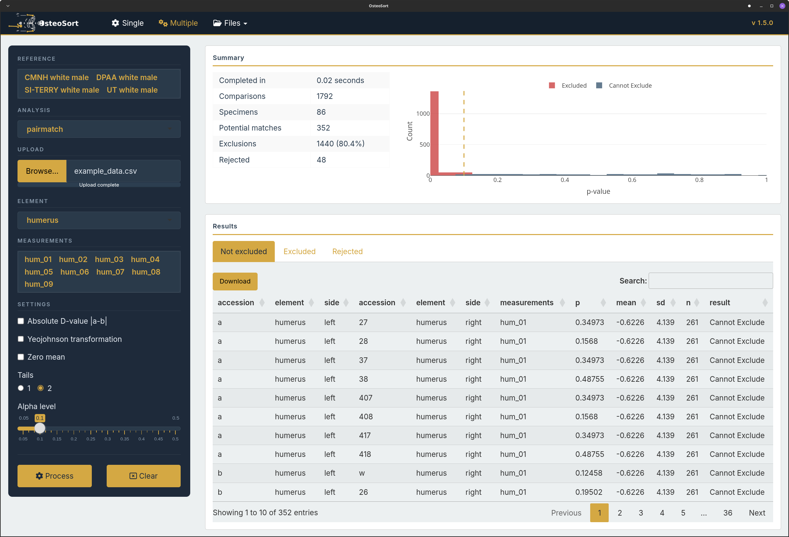

# OsteoSort 1.5.0


Computerized osteometric sorting application built with R/Shiny and Julia. OsteoSort uses statistical methods to compare skeletal measurements against reference populations, aiding in the reassociation of commingled remains.

**Key Features:**
- **Pair-matching** — statistical comparison of bilateral skeletal elements
- **Articulation** — assessment of joint congruence between adjacent bones
- **Osteometric sorting by regression** — size-based reassociation using OLS regression
- Interactive Plotly visualizations with CSV export
- PostgreSQL-backed reference populations (ARDS)



## Architecture

| Layer | Technology |
|-------|------------|
| Frontend | R/Shiny UI |
| Backend (statistical) | R + Julia (compiled shared library) |
| Database | PostgreSQL (ARDS) |
| Deployment | Docker (two-stage build) |
| Julia compilation | PackageCompiler.jl (`create_library`) |

## Prerequisites

- Docker
- A running PostgreSQL instance with the ARDS osteometry schema
- A `.env` file inside `OsteoSort/` with database credentials:
  ```
  DB_HOST=<host>
  DB_PORT=<port>
  DB_USER=<user>
  DB_PASS=<password>
  DB_NAME=<database>
  ```

## Installation

```sh
git clone https://github.com/dpaa-gov/OsteoSort
cd OsteoSort
docker build -t osteosort .
docker run --restart=on-failure:10 --name=osteosort -d -p 4001:3838 osteosort
docker network connect app_bridge osteosort 
```

The app will be available at `http://localhost:4001/OsteoSort`.

## Local Development (Without Docker)

### Requirements

- R 4.x with packages listed in [Dependencies](#dependencies)
- Julia 1.11+ (for building the shared library)
- GCC (for building the C shim)
- PostgreSQL client library (`libpq-dev` on Debian/Ubuntu)
- `.env` file in `OsteoSort/` with DB credentials (see [Prerequisites](#prerequisites))

### Build the Shared Library (one-time)

```sh
# Build libosj.so
julia --project=OSJ build/create_library.jl

# Build C shim
gcc -shared -fPIC -o build/r_osj_shim.so build/r_osj_shim.c \
    -L dist/libosj/lib -losj -Wl,-rpath,$(pwd)/dist/libosj/lib
```

### Run

```sh
LD_LIBRARY_PATH=dist/libosj/lib:dist/libosj/lib/julia Rscript start_dev.R
```

The app will open at `http://127.0.0.1:4001`.

## Project Structure

```
OsteoSort/
├── Dockerfile             # Two-stage: builder compiles .so, runtime is lean
├── start_dev.R            # Local dev server launcher
├── shiny-server.conf
├── OsteoSort/             # Shiny application
│   ├── server.r           # Server entry point (loads osj.r, calls osj_load())
│   ├── ui.r               # UI entry point
│   ├── R/                 # Analytical R functions
│   │   ├── osj.r          # Shared library interface (dyn.load + wrappers)
│   │   ├── ttest.r        # T-test analysis (calls osj_ttest)
│   │   └── reg.test.r     # Regression analysis (calls osj_regsl)
│   ├── server/            # Server modules (reference, single, files, etc.)
│   ├── ui/                # UI modules
│   ├── extdata/           # Config files (articulation_config, etc.)
│   └── www/               # Static assets (CSS, JS, images)
├── OSJ/                   # Julia analytical package
│   ├── Project.toml
│   └── src/
│       ├── OSJ.jl         # Module definition
│       └── c_api.jl       # @ccallable wrappers for R .C() interface
├── build/                 # Build scripts
│   ├── create_library.jl  # PackageCompiler library build
│   ├── library_precompile.jl
│   └── r_osj_shim.c      # C shim for init_julia ABI bridging
└── dist/                  # Build output (gitignored)
    └── libosj/
        └── lib/libosj.so
```

## Dependencies

### R
| Package | Purpose |
|---------|---------|
| shiny | Web framework |
| htmltools | HTML generation |
| DT | Interactive data tables |
| dplyr | Data manipulation |
| shinyalert | Alert dialogs |
| DBI | Database interface |
| RPostgres | PostgreSQL driver |
| dotenv | Environment variable loading |
| plotly | Interactive plots |

### Julia (OSJ package)
| Package | Purpose |
|---------|---------|
| Statistics | Statistical functions |
| Optim | Optimization |
| Rmath | R math distributions |
| GLM | Generalized linear models |

## Acknowledgments

- **Alex Moore** — UI styling suggestions and design inspiration

## Citation

Lynch, J.J. 2026 OsteoSort. Computerized Osteometric Sorting. Version 1.5.0. Defense POW/MIA Accounting Agency, Offutt AFB, NE.

## TODO

1. User beta testing
2. Replace `.env` file with injected environment variables

## License

GNU General Public License v2.0