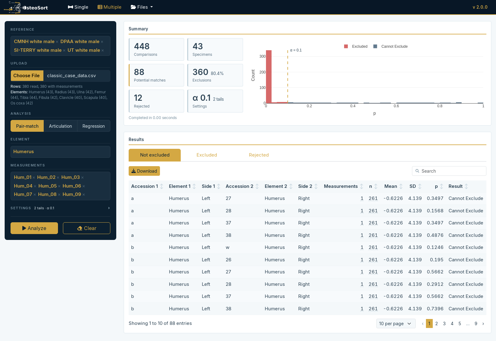

# OsteoSort 1.5.0


Computerized osteometric sorting application built with R/Shiny and Julia. OsteoSort uses statistical methods to compare skeletal measurements against reference populations, aiding in the reassociation of commingled remains.

**Key Features:**
- **Pair-matching** — statistical comparison of bilateral skeletal elements
- **Articulation** — assessment of joint congruence between adjacent bones
- **Osteometric sorting by regression** — size-based reassociation using OLS regression
- Interactive Plotly visualizations with CSV export
- PostgreSQL-backed reference populations (ARDS)



## Architecture

| Layer | Technology |
|-------|------------|
| Frontend | R/Shiny UI |
| Backend (statistical) | R + Julia (compiled shared library) |
| Database | PostgreSQL (ARDS) |
| Deployment | Docker (prebuilt libosj from GitHub Release) |
| Julia compilation | PackageCompiler.jl (`create_library`) |

## Prerequisites

- Docker
- A running PostgreSQL instance with the ARDS osteometry schema
- Database credentials as environment variables:
  ```
  DB_HOST=<host>
  DB_PORT=<port>
  DB_USER=<user>
  DB_PASS=<password>
  DB_NAME=<database>
  ```

In production these are injected by Atlas; nothing needs to be configured in the image.

## Running with Docker

Production deployments go through Atlas from a release tag (see [Releasing](#releasing)). To run a release yourself, clone that tag so the code matches its prebuilt library:

```sh
git clone --branch vX.Y.Z https://github.com/dpaa-gov/OsteoSort
cd OsteoSort
docker build -t osteosort .
docker run -d -p 4001:3838 \
    -v /path/to/osteosort.Renviron:/home/shiny/.Renviron:ro \
    osteosort
```

`osteosort.Renviron` holds the `DB_*` variables above, one per line. Shiny Server does not pass container environment variables (`docker run -e`) through to the app, so they are read from `/home/shiny/.Renviron` instead — Atlas writes this file the same way at startup.

The app will be available at `http://localhost:4001/OsteoSort`.

The image does not compile Julia. It downloads the prebuilt `libosj-linux-x86_64.tar.gz` from the GitHub Release named by `ARG LIBOSJ_VERSION` in the `Dockerfile`, so that release must already have its asset attached (see [Releasing](#releasing)).

## Releasing

The Julia shared library is built once per release by GitHub Actions (`.github/workflows/release.yml`), not during deployment.

1. Set `ARG LIBOSJ_VERSION=vX.Y.Z` in the `Dockerfile` and `X.Y.Z` in `OsteoSort/VERSION` (shown in the app header). For a final release, also update the version in this README and the citation. Commit and push.
2. Publish a GitHub Release with tag `vX.Y.Z`. For a release candidate, use a tag like `vX.Y.Z-rc1` (with `X.Y.Z-rc1` in `VERSION`) and tick **Set as a pre-release**.
3. The workflow checks the `Dockerfile` and `VERSION` match the tag, builds the library with `build/Dockerfile.libosj`, runs `build/libosj_smoke.R` against it in `rocker/shiny`, and attaches `libosj-linux-x86_64.tar.gz` (plus a `.sha256`) to the release. This takes about 20–30 minutes; progress is in the Actions tab.
4. Once the asset appears on the release, deploy tag `vX.Y.Z` in Atlas.

If the workflow fails, nothing is attached and a deploy of that tag fails at the download step. Fix the problem and use **Re-run jobs** on the failed run, which replaces any partial upload.

To build the library locally without publishing:

```sh
docker build -f build/Dockerfile.libosj --output type=local,dest=out .
```

## Local Development (Without Docker)

### Requirements

- R 4.x with packages listed in [Dependencies](#dependencies)
- Julia 1.11+ (for building the shared library)
- GCC (for building the C shim)
- PostgreSQL client library (`libpq-dev` on Debian/Ubuntu)
- `DB_*` environment variables exported in your shell (see [Prerequisites](#prerequisites))

### Build the Shared Library (one-time)

```sh
# Build libosj.so
julia --project=OSJ build/create_library.jl

# Build C shim
gcc -shared -fPIC -o build/r_osj_shim.so build/r_osj_shim.c \
    -L dist/libosj/lib -losj -Wl,-rpath,$(pwd)/dist/libosj/lib
```

### Run

```sh
LD_LIBRARY_PATH=dist/libosj/lib:dist/libosj/lib/julia Rscript start_dev.R
```

The app will open at `http://127.0.0.1:4001`.

## Project Structure

```
OsteoSort/
├── Dockerfile             # Runtime image; downloads prebuilt libosj from the release
├── .github/workflows/
│   └── release.yml        # On release: build, smoke test, attach libosj asset
├── start_dev.R            # Local dev server launcher
├── shiny-server.conf
├── OsteoSort/             # Shiny application
│   ├── server.r           # Server entry point (loads osj.r, calls osj_load())
│   ├── ui.r               # UI entry point
│   ├── R/                 # Analytical R functions
│   │   ├── osj.r          # Shared library interface (dyn.load + wrappers)
│   │   ├── ttest.r        # T-test analysis (calls osj_ttest)
│   │   └── reg.test.r     # Regression analysis (calls osj_regsl)
│   ├── server/            # Server modules (reference, single, files, etc.)
│   ├── ui/                # UI modules
│   ├── extdata/           # Config files (articulation_config, etc.)
│   └── www/               # Static assets (CSS, JS, images)
├── OSJ/                   # Julia analytical package
│   ├── Project.toml
│   └── src/
│       ├── OSJ.jl         # Module definition
│       └── c_api.jl       # @ccallable wrappers for R .C() interface
├── build/                 # Build scripts
│   ├── create_library.jl  # PackageCompiler library build (local dev)
│   ├── Dockerfile.libosj  # Library build used for releases
│   ├── libosj_smoke.R     # Smoke test run against each release build
│   ├── library_precompile.jl
│   └── r_osj_shim.c      # C shim for init_julia ABI bridging
└── dist/                  # Build output (gitignored)
    └── libosj/
        └── lib/libosj.so
```

## Dependencies

### R
| Package | Purpose |
|---------|---------|
| shiny | Web framework |
| htmltools | HTML generation |
| DT | Interactive data tables |
| dplyr | Data manipulation |
| shinyalert | Alert dialogs |
| DBI | Database interface |
| RPostgres | PostgreSQL driver |
| plotly | Interactive plots |

### Julia (OSJ package)
| Package | Purpose |
|---------|---------|
| Statistics | Statistical functions |
| Optim | Optimization |
| Rmath | R math distributions |
| GLM | Generalized linear models |

## Citation

Lynch, J.J. 2026 OsteoSort. Computerized Osteometric Sorting. Version 1.5.0. Defense POW/MIA Accounting Agency, Offutt AFB, NE.

## License

GNU General Public License v2.0